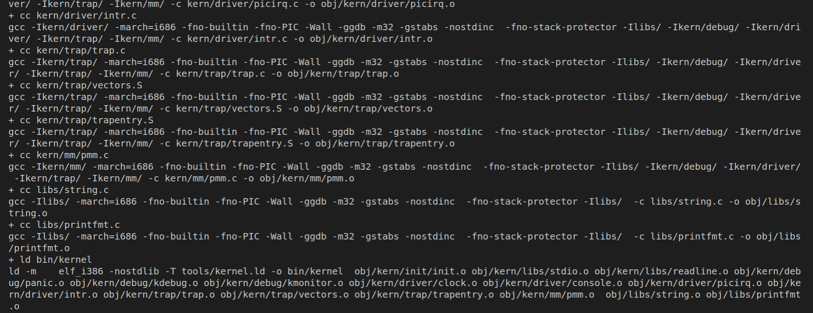
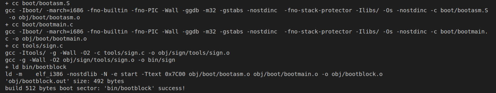
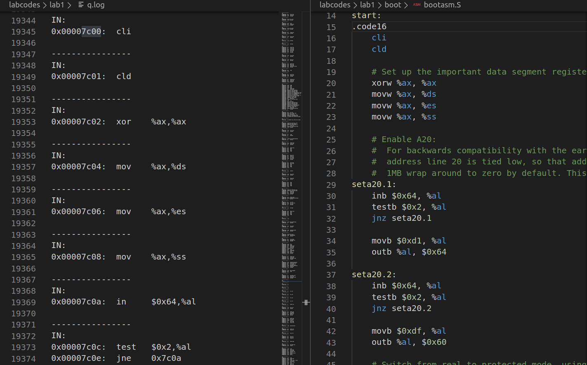
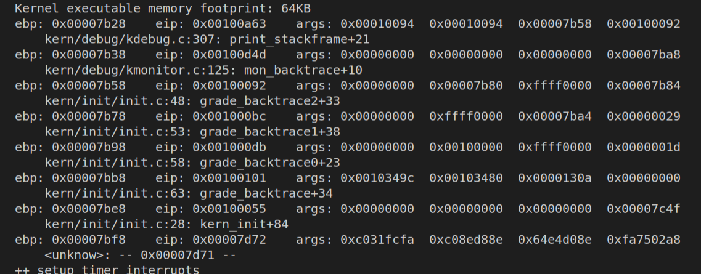
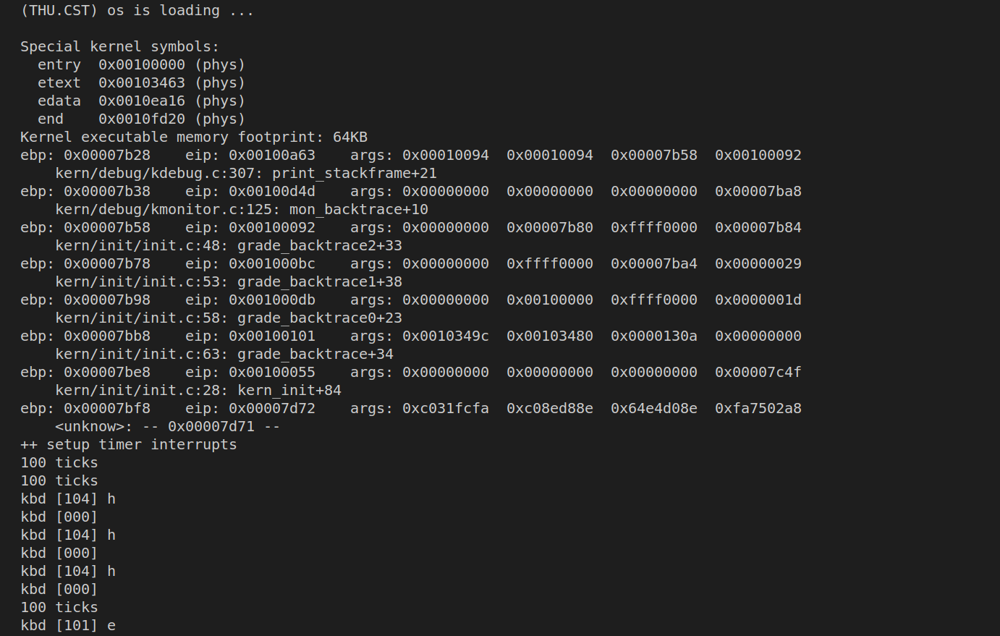

# ucore lab1 实验报告

王焱 计73 2017050024

## 实验目的
(列出本实验各练习中对应的 OS 原理的知识点，并说明本实验中的实现部分如何对应和体现了原理中的基本概念和关键知识点。)

练习一: 通过makefile生成ucore.img的过程,了解操作系统的组成部分,有bootblock和kernel.

练习二: 通过使用gdb调试操作系统, 了解计算机在操作系统控制之前都进行了那些操作.

练习三: 了解实模式与操作系统所在的保护模式的区别,以及转换过程,涉及到全局描述符表,A20开关.分段机制等知识点.

练习四: 了解操作系统文件的ELF格式,以及如何使用LBA读取磁盘数据.

练习五: 了解操作系统的函数调用栈,以及bootmain和kerninit实际运行的地址.

练习六: 了解操作系统的中断机制,中断描述符的格式,中断的处理流程.


## 实验内容

### 练习1: 理解通过 make 生成执行文件的过程

**1.1 操作系统镜像文件 ucore.img 是如何一步一步生成的？(需要比较详细地解释 Makefile 中每一条相关命令和命令参数的含义，以及说明命令导致的结果)**

```makefile
# create ucore.img
UCOREIMG	:= $(call totarget,ucore.img)

$(UCOREIMG): $(kernel) $(bootblock)
	$(V)dd if=/dev/zero of=$@ count=10000
	$(V)dd if=$(bootblock) of=$@ conv=notrunc
	$(V)dd if=$(kernel) of=$@ seek=1 conv=notrunc

$(call create_target,ucore.img)
```
查看makefile中有关生成ucore.img的代码,发现需要先生成kernel和bootlock.分别查看makefile中的这两部分.

生成kernel的代码:
```makefile
# create kernel target
kernel = $(call totarget,kernel)

$(kernel): tools/kernel.ld

$(kernel): $(KOBJS)
	@echo + ld $@
	$(V)$(LD) $(LDFLAGS) -T tools/kernel.ld -o $@ $(KOBJS)
	@$(OBJDUMP) -S $@ > $(call asmfile,kernel)
	@$(OBJDUMP) -t $@ | $(SED) '1,/SYMBOL TABLE/d; s/ .* / /; /^$$/d' > $(call symfile,kernel)

$(call create_target,kernel)

```

生成kernel需要先生成KSRCDIR目录下源文件的.o文件,和kernel.ld文件.kernel.ld已经存在,以下是生成obj文件的代码:
```makefile
# kernel

KINCLUDE	+= kern/debug/ \
			   kern/driver/ \
			   kern/trap/ \
			   kern/mm/

KSRCDIR		+= kern/init \
			   kern/libs \
			   kern/debug \
			   kern/driver \
			   kern/trap \
			   kern/mm

KCFLAGS		+= $(addprefix -I,$(KINCLUDE))

$(call add_files_cc,$(call listf_cc,$(KSRCDIR)),kernel,$(KCFLAGS))

KOBJS	= $(call read_packet,kernel libs)
```

其中编译选项有如下内容:
```makefile
CFLAGS	:= -march=i686 -fno-builtin -fno-PIC -Wall -ggdb -m32 -gstabs -nostdinc $(DEFS)
CFLAGS	+= $(shell $(CC) -fno-stack-protector -E -x c /dev/null >/dev/null 2>&1 && echo -fno-stack-protector)
```
其中一些参数的含义:
-ggdb  生成可供gdb使用的调试信息,
-m32  生成适用于32位环境的代码,
-gstabs  生成stabs格式的调试信息,
-nostdinc  不使用标准库,
-fno-stack-protector  不生成用于检测缓冲区溢出的代码.

通过 make V= 命令查看该过程对应的具体执行语句




生成bootblock的代码:
```makefile
bootblock = $(call totarget,bootblock)

$(bootblock): $(call toobj,$(bootfiles)) | $(call totarget,sign)
	@echo + ld $@
	$(V)$(LD) $(LDFLAGS) -N -e start -Ttext 0x7C00 $^ -o $(call toobj,bootblock)
	@$(OBJDUMP) -S $(call objfile,bootblock) > $(call asmfile,bootblock)
	@$(OBJCOPY) -S -O binary $(call objfile,bootblock) $(call outfile,bootblock)
	@$(call totarget,sign) $(call outfile,bootblock) $(bootblock)

$(call create_target,bootblock)
```

要生成bootblock需要先生成bootasm.o、bootmain.o、sign
```makefile
# create bootblock
bootfiles = $(call listf_cc,boot)
$(foreach f,$(bootfiles),$(call cc_compile,$(f),$(CC),$(CFLAGS) -Os -nostdinc))
```

通过 make V= 命令查看该过程对应的具体执行语句




**1.2 一个被系统认为是符合规范的硬盘主引导扇区的特征是什么？**

sign.c中是生成一个符合规范的硬盘主引导扇区的代码,查看代码可知,硬盘主引导扇区的大小一共为512字节,并且第510字节是0x55,第510字节是0xAA.


### 练习2: 使用 qemu 执行并调试 lab1 中的软件

使用make debug命令,进行gdb调试

**2.1 从 CPU 加电后执行的第一条指令开始，单步跟踪 BIOS 的执行。**

```gdbinit
target remote:1234
set architecture i8086
define hook-stop
x/i $pc
end
```

**2.2 在初始化位置 0x7c00 设置实地址断点,测试断点正常。**

在gdbinit中添加以下命令设置断点

```gdbinit
break *0x7c00
continue
set architecture i386
```

**2.3 从 0x7c00 开始跟踪代码运行,将单步跟踪反汇编得到的代码与 bootasm.S 和 bootblock.asm 进行比较。**

在makefile debug目标下启动qemu时添加 `-d in_asm -D q.log` 选项,以保存运行的汇编指令到q.log中.


   

**2.4 自己找一个 bootloader 或内核中的代码位置，设置断点并进行测试。**

在gdbinit中添加以下命令设置断点,单步执行kern_init函数,用s命令可进入函数内部继续查看执行.

```
file bin/kernel
break kern_init
continue
```


### 练习3: 分析 bootloader 进入保护模式的过程

**3.1 BIOS 将通过读取硬盘主引导扇区到内存，并转跳到对应内存中的位置执行 bootloader。请分析 bootloader 是如何完成从实模式进入保护模式的。**

查看bootasm.S中的实现过程并分析:

```assembly
cli                                             # Disable interrupts
cld                                             # String operations increment
# Set up the important data segment registers (DS, ES, SS). 
xorw %ax, %ax                                   # Segment number zero
movw %ax, %ds                                   # -> Data Segment
movw %ax, %es                                   # -> Extra Segment
movw %ax, %ss                                   # -> Stack Segment
```
首先用cli(Clear Interupt)命令禁止中断，再用cld(Clear Director)命令修改控制方向标志寄存器DF=0，使得内存地址从低到高增加. 然后用 %ax 将几个数据段寄存器清零.

```assembly
seta20.1:
    inb $0x64, %al                                  # Wait for not busy(8042 input buffer empty).
    testb $0x2, %al
    jnz seta20.1
    movb $0xd1, %al                                 # 0xd1 -> port 0x64
    outb %al, $0x64                                 # 0xd1 means: write data to 8042's P2 port
seta20.2:
    inb $0x64, %al                                  # Wait for not busy(8042 input buffer empty).
    testb $0x2, %al
    jnz seta20.2
    movb $0xdf, %al                                 # 0xdf -> port 0x60
    outb %al, $0x60                                 # 0xdf = 11011111, means set P2's A20 bit(the 1 bit) to 1
```
上面这段代码是用来打开键盘控制器上的A20开关.之所以需要开启A20有两个原因:一是因为要保持实模式下,当A20关闭时仍然保持只有20根地址线时的"回卷"访问的方式,访问范围只有1M,开启之后32位地址线全部可用,访问空间为4G;二是在保护模式下,当A20未开启时,第21根地址线恒为零,所以只能访问奇数兆内存.

将A20打开的方法,主要是如何控制使用8042键盘控制器,先等待input buiffer为空,向其写入0xd1写命令,再等待input buffer 为空,向60端口写入0xdf将A20对应的1bit置为1.

```assembly
    lgdt gdtdesc # 初始化GDT

    movl %cr0, %eax
    orl $CR0_PE_ON, %eax 
    movl %eax, %cr0 # 将cr0控制寄存器的PE位置为1, 打开保护模式
```
至此bootloader已经完成了从实模式到保护模式的转换,剩下的部分就是设置段寄存器,建立堆栈,最后调用bootmain函数.


### 练习4: 分析 bootloader 加载 ELF 格式的 OS 的过程

查看bootmain.c中的实现过程并分析.

**4.1 bootloader 如何读取硬盘扇区的？**

首先了解到LBA访问方式是指,通过逻辑区块地址(Logical Block Address, LBA),进行地址和区块之间的转换.
```c
/* readsect - read a single sector at @secno into @dst */
static void
readsect(void *dst, uint32_t secno) {
    // wait for disk to be ready
    waitdisk();

    outb(0x1F2, 1);                         // count = 1
    outb(0x1F3, secno & 0xFF);
    outb(0x1F4, (secno >> 8) & 0xFF);
    outb(0x1F5, (secno >> 16) & 0xFF);
    outb(0x1F6, ((secno >> 24) & 0xF) | 0xE0);
    outb(0x1F7, 0x20);                      // cmd 0x20 - read sectors

    // wait for disk to be ready
    waitdisk();

    // read a sector
    insl(0x1F0, dst, SECTSIZE / 4);  // 单位是double word
}
```
这段代码通过设置IO地址寄存器0x1f0-0x1f7来控制读取磁盘上一个指定的扇区. 0x1F2为要读写的扇区数,0x1F3到0x1F6指定了扇区号,0-27位为偏移量,第28位为0表示访问0号主盘,29-31位强制设为1.waitdisk()函数是判断0x1F7状态和命令寄存器状态.

**4.2bootloader 是如何加载 ELF 格式的 OS？**

```c
// read the 1st page off disk
readseg((uintptr_t)ELFHDR, SECTSIZE * 8, 0);
// is this a valid ELF?
if (ELFHDR->e_magic != ELF_MAGIC) {
    goto bad;
}
```
从磁盘读取第一页共8个扇区,并判断该ELF文件是否合法

```c
struct proghdr *ph, *eph;
// load each program segment (ignores ph flags)
ph = (struct proghdr *)((uintptr_t)ELFHDR + ELFHDR->e_phoff);
eph = ph + ELFHDR->e_phnum;
for (; ph < eph; ph ++) {
    readseg(ph->p_va & 0xFFFFFF, ph->p_memsz, ph->p_offset);
}
```
首先根据ELF头中的e_phoff找到程序头部表的位置,然后依次访问ELF头中记录的e_phnum个程序头,根据程序头中记录的地址(p_va),大小(p_memsz)和偏移(p_offset),利用readseg函数载入内存.

```c
((void (*)(void))(ELFHDR->e_entry & 0xFFFFFF))();
```
根据ELF头储存的入口信息，找到内核的入口.


### 练习5: 实现函数调用堆栈跟踪函数 

实现debug.c中的print_stackframe函数.利用给出的接口获取ebp和eip的值,ebp为当前栈帧基址并且存储着上一层栈帧基址,因此可以不断回溯之前的函数调用栈,在每一层由相对于ebp的偏移量又可访问函数参数以及返回地址.

```c
eip = *((uint32_t*)ebp+1);
ebp = *((uint32_t*)ebp);
```

最后一行即调用栈的最深层,应该是bootmain函数,booloader从0x7c00开始,call bootmain 指令压栈,所以可知bootmain的ebp为0x7bf8.


### 练习6: 完善中断初始化和处理 

**6.1 中断描述符表（也可简称为保护模式下的中断向量表）中一个表项占多少字节？其中哪几位代表中断处理代码的入口？**

中断向量表一个表项用struct gatedesc表示,一共64bit,占用8字节,输出sizeof(struct gatedesc)验证也的确是8字节.其中2-3字节是段选择子，0-1字节和6-7字节拼成位移，两者联合便是中断处理程序的入口地址。

**6.2 请编程完善 kern/trap/trap.c 中对中断向量表进行初始化的函数 idt_init。在 idt_init 函数中，依次对所有中断入口进行初始化。使用 mmu.h 中的 SETGATE 宏，填充 idt 数组内容。每个中断的入口由 tools/vectors.c 生成，使用 trap.c 中声明的 vectors 数组即可。**

```c
    extern uintptr_t __vectors[]; // ISR's entry addrs

    for(int i=0;i<sizeof(idt)/sizeof(struct gatedesc);i++){
        SETGATE(idt[i], 0, GD_KTEXT, __vectors[i], DPL_KERNEL)
    }
    SETGATE(idt[T_SWITCH_TOK], 0, GD_KTEXT, __vectors[T_SWITCH_TOK], DPL_USER); // 

    lidt(&idt_pd);
```
首先使用SETGATE宏,依次初始化每个中断描述符表的表项,即生成相应的描述符. 种类全部设置为interupt,权限全部设置为kernel(ring0),从__vectors中获取中断入口.然后将定义的由用户态转到内核态中断的权限改为user.最后使用lidt加载初始化好的中断描述符表.

**6.3 请编程完善 trap.c 中的中断处理函数 trap，在对时钟中断进行处理的部分填写 trap 函数中处理时钟中断的部分，使操作系统每遇到 100 次时钟中断后，调用 print_ticks 子程序，向屏幕上打印一行文字”100 ticks”。**

实验结果
    


## 实验小结

lab1主要是阅读代码了解ucore的整体框架,并且将一些概念上的东西对应到实现上.另外初步了解了操作系统的调试方法.