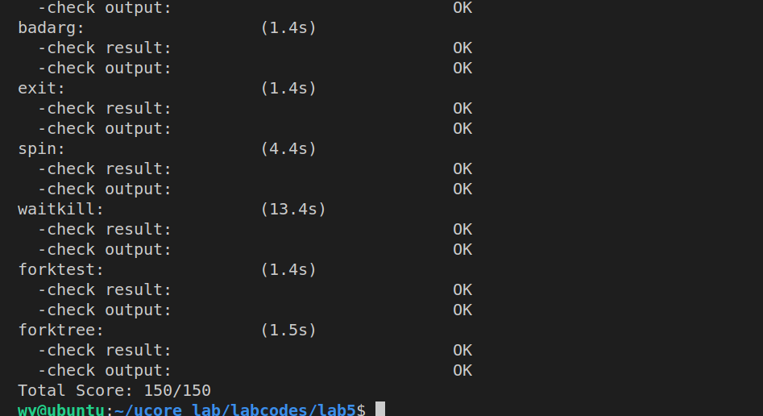

# ucore lab5 实验报告

## 实验目的

- 了解第一个用户进程创建过程
- 了解系统调用框架的实现机制
- 了解 ucore 如何实现系统调用 sys_fork/sys_exec/sys_exit/sys_wait 来进行进程管理

## 实验内容

实验 4 完成了内核线程，但到目前为止，所有的运行都在内核态执行。实验 5 将创建用户进程，让用户进程在用户态执行，且在需要 ucore 支持时，可通过系统调用来让 ucore 提供服务。为此需要构造出第一个用户进程，并通过系统调用 sys_fork/sys_exec/sys_exit/sys_wait 来支持运行不同的应用程序，完成对用户进程的执行过程的基本管理。相关原理介绍可看附录 B。

### 练习 0：填写已有实验

本实验依赖实验 1/2/3/4。请把你做的实验 1/2/3/4 的代码填入本实验中代码中有“LAB1”/“LAB2”/“LAB3”/“LAB4”的注释相应部分。注意：为了能够正确执行 lab5 的测试应用程序，可能需对已完成的实验 1/2/3/4 的代码进行进一步改进。

具体更新的内容有如下几处：

- 在初始化IDT的时候，设置系统调用对应的中断描述符，使其能够在用户态下被调用，并且设置为trap类型；
- 在时钟中断的处理部分，每过TICK_NUM个中断，就将当前的进程设置为可以被重新调度的，这样使得当前的线程可以被换出，从而实现多个线程的并发执行；
- 在proc_alloc函数中，对进程控制块中新增加的wait_state, cptr, yptr, optr成员变量进行初始化；
- 在do_fork函数中，使用set_links函数来完成将fork的线程添加到线程链表中的过程，并将原来的这个操作删掉。

### 练习 1: 加载应用程序并执行

do_execv函数调用 load_icode（位于 kern/process/proc.c 中）来加载并解析一个处于内存中的 ELF 执行文件格式的应用程序，建立相应的用户内存空间来放置应用程序的代码段、数据段等，且要设置好 proc_struct 结构中的成员变量 trapframe 中的内容，确保在执行此进程后，能够从应用程序设定的起始执行地址开始执行。需设置正确的 trapframe 内容。

- 设计实现过程

    do_execve函数是sys_exec系统调用的最终的处理函数，该函数中退出了当前进程的内存空间，改使用了内核的内存空间，调用load_icode函数完成对新进程内存空间的初始化。另外，和内核线程相似，通过修改中断帧以中断返回的方式执行目标进程，对于用户进程，则需要进行如下设置：

    ```c
    tf->tf_cs = USER_CS;
    tf->tf_ds = tf->tf_es = tf->tf_ss = USER_DS;
    tf->tf_esp = USTACKTOP;
    tf->tf_eip = elf->e_entry;//进程入口地址
    tf->tf_eflags = FL_IF;//使能中断
    ```

- 请在实验报告中描述当创建一个用户态进程并加载了应用程序后，CPU 是如何让这个应用程序最终在用户态执行起来的。即这个用户态进程被 ucore 选择占用 CPU 执行（RUNNING 态）到具体执行应用程序第一条指令的整个经过。

    - 在经过调度器占用了CPU的资源之后，用户态进程进行系统调用，从而转入到了系统调用的处理例程；
  
    - 在经过了正常的中断处理例程之后，最终控制权转移到了syscall.c中的syscall函数，然后根据系统调用号转移给了sys_exec函数，在该函数中调用了do_execve函数来完成指定应用程序的加载；
  
    - 在do_execve中进行了若干设置，包括退出当前进程的页表，换用kernel的PDT之后，使用load_icode函数，完成了对整个用户线程内存空间的初始化，包括堆栈的设置以及将ELF可执行文件的加载，之后通过current->tf指针修改了当前系统调用的trapframe；
  
    - 在完成了do_exec函数之后，进行正常的中断返回的流程，由于中断处理例程的栈上面的eip已经被修改成了应用程序的入口处，而cs上的CPL是用户态，因此iret进行中断返回的时候会将堆栈切换到用户的栈，并且完成特权级的切换，并且跳转到要求的应用程序的入口处；

    - 接下来开始具体执行应用程序的第一条指令；


### 练习 2: 父进程复制自己的内存空间给子进程（需要编码）

创建子进程的函数 do_fork 在执行中将拷贝当前进程（即父进程）的用户内存地址空间中的合法内容到新进程中（子进程），完成内存资源的复制。具体是通过 copy_range 函数（位于 kern/mm/pmm.c 中）实现的，请补充 copy_range 的实现，确保能够正确执行。

- 设计实现过程

    函数调用流程：do_fork() -> copy_mm() -> dup_mmap() -> copy_range()

    该函数的功能：以页为单位将父进程的内存空间复制到子进程的内存空间

    ```c
        void* src_kvaddr = page2kva(page);
        void* dst_kvaddr = page2kva(npage);
        memcpy(dst_kvaddr, src_kvaddr, PGSIZE);
        page_insert(to,npage,start,perm);
    ```

- 请在实验报告中简要说明如何设计实现”Copy on Write 机制“，给出概要设计，鼓励给出详细设计。

    该机制的主要思想：读操作可共享，写时再创建副本。

    设计思路：进程执行fork进行复制的时候，暂时共享相同的物理内存页，而当其中一个进程需要对内存进行修改的时候，再额外创建一个自己私有的物理内存页，将共享的内容复制过去，然后在自己的内存页中进行修改。因此修改应当主要有两个部分，一个部分在于进行fork操作的时候不直接复制内存，而是将子进程和父进程的虚拟页映射上同一个物理页面，然后在分别在这两个进程的虚拟页对应的PTE部分将这个页置成是不可写的，另外一个处理在于出现了内存页访问异常的时候，判断如果是写一个引用数大于一的页，则额外申请分配一个物理页面，然后将当前的页的内容复制过去，建立出错的线性地址与新创建的物理页面的映射关系，然后在新的内存页进行修改。


### 练习 3: 阅读分析源代码，理解进程执行 fork/exec/wait/exit 的实现，以及系统调用的实现（不需要编码）

- fork/exec/wait/exit 函数的分析

    fork：在执行了fork系统调用之后，会执行正常的中断处理流程，最终将控制权转移给syscall，之后根据系统调用号执行sys_fork函数，进一步执行了上文中的do_fork函数，完成新的进程的进程控制块的初始化、设置、以及将父进程内存中的内容到子进程的内存的复制工作，然后将新创建的进程放入可执行队列（runnable），之后便可能由调度器将子进程运行起来了。
    
    exec：在执行了exec系统调用之后，会执行正常的中断处理流程，最终将控制权转移给syscall，之后根据系统调用号执行sys_exec函数，进一步执行了上文中的do_execve函数，在该函数中，会对内存空间进行清空，然后将新的要执行的程序加载到内存中，然后设置好中断帧，使得最终中断返回之后可以跳转到指定的应用程序的入口处，在用户态执行。
    
    wait：在执行了wait系统调用之后，会执行正常的中断处理流程，最终将控制权转移给syscall，之后根据系统调用号执行sys_wait函数，进一步执行了的do_wait函数，在这个函数中，将搜索是否指定进程存在着处于ZOMBIE态的子进程，如果有的话直接将其占用的资源释放掉即可；如果没有这种子进程，则将当前进程的状态改成SLEEPING态，并且标记为等待ZOMBIE态的子进程，然后调用schedule函数将其当前线程从CPU占用中切换出去，直到有对应的子进程结束来唤醒这个进程为止。
    
    exit：在执行了exit系统调用之后，会执行正常的中断处理流程，最终将控制权转移给syscall，之后根据系统调用号执行sys_exit函数，进一步执行了的do_exit函数，首先将释放当前进程的大多数资源，然后将其标记为ZOMBIE态，然后调用wakeup_proc函数将其父进程唤醒，然后调用schedule函数，让出CPU资源，等待父进程进一步完成其所有资源的回收。

   
- 请分析 fork/exec/wait/exit 在实现中是如何影响进程的执行状态的？

    主要观察对proc->state的修改，以下是四种操作对进程状态的影响：

    fork不会影响当前进程的执行状态，会将新产生的子进程的状态标记为RUNNALB，经过调度后可以占用CPU开始运行，二者通过fork返回的值不同来判断当前进程是子进程还是父进程；

    exec不会影响当前进程的执行状态，重新创建当前进程的执行环境，并加载执行程序，然后进入用户态执行用户进程；

    wait系统调用取决于是否存在可以释放资源（ZOMBIE）的子进程，如果有的话不会发生状态的改变，如果没有的话会将当前进程置为SLEEPING态，等待执行了exit的子进程将其唤醒；

    exit会将当前进程的状态修改为ZOMBIE态，并且会将父进程唤醒（由SLWWPING修改为RUNNABLE），然后主动让出CPU使用权；


- 请给出 ucore 中一个用户态进程的执行状态生命周期图（包执行状态，执行状态之间的变换关系，以及产生变换的事件或函数调用）。（字符方式画即可）

```
process state changing:
                                            
  alloc_proc                                 RUNNING
      +                                   +--<----<--+
      +                                   + proc_run +
      V                                   +-->---->--+ 
PROC_UNINIT -- proc_init/wakeup_proc --> PROC_RUNNABLE -- try_free_pages/do_wait/do_sleep --> PROC_SLEEPING --
                                           A      +                                                           +
                                           |      +--- do_exit --> PROC_ZOMBIE                                +
                                           +                                                                  + 
                                           -----------------------wakeup_proc----------------------------------
```

### 执行 make grade 得到如下结果：




## 实验小结

- 参考答案分析对比

    本次要写的代码较少且注释很明确与参考答案基本一致。

- 实验中重要知识点与其对应的OS原理
    
    ELF可执行文件的格式；
    用户进程的创建和管理；
    进程状态模型；
    系统调用的实现；
    
- 本次实验中未涉及的知识点有：
  
    进程的挂起状态；
