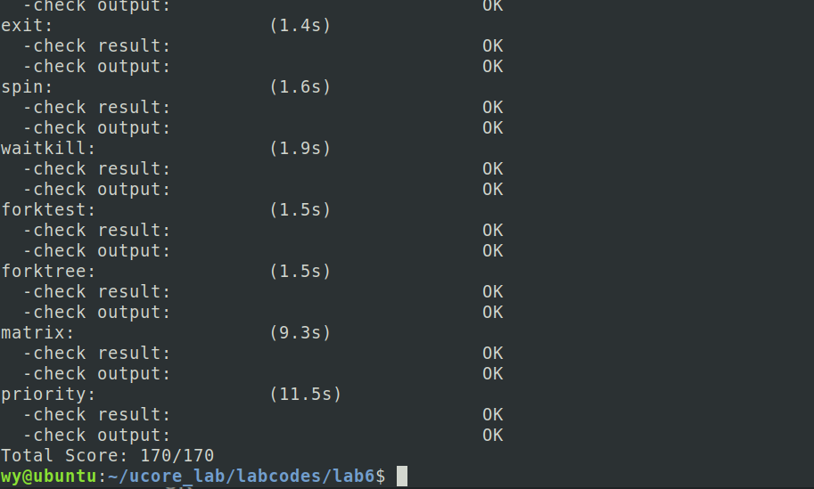

# ucore lab6 实验报告

## 实验目的

- 理解操作系统的调度管理机制
- 熟悉 ucore 的系统调度器框架，以及缺省的 Round-Robin 调度算法
- 基于调度器框架实现一个(Stride Scheduling)调度算法来替换缺省的调度算法

## 实验内容

实验五完成了用户进程的管理，可在用户态运行多个进程。但到目前为止，采用的调度策略是很简单的 FIFO 调度策略。本次实验，主要是熟悉 ucore 的系统调度器框架，以及基于此框架的 Round-Robin（RR） 调度算法。然后参考 RR 调度算法的实现，完成 Stride Scheduling 调度算法。

### 练习 0：填写已有实验

本实验依赖实验 1/2/3/4/5。请把你做的实验 2/3/4/5 的代码填入本实验中代码中有“LAB1”/“LAB2”/“LAB3”/“LAB4”“LAB5”的注释相应部分。并确保编译通过。注意：为了能够正确执行 lab6 的测试应用程序，可能需对已完成的实验 1/2/3/4/5 的代码进行进一步改进。

具体修改内容如下：

- 发生时钟中断时，不需要直接在trap_dispatch中进行调度的设置，而是间接使用sched_class中的函数指针proc_tick来完成；
- 在对proc_struct中针对lab6添加的接口初始化。在proc.c的alloc_proc函数中

修改之后，运行make grade，除了priority测试外，其他测试均能通过。

### 练习 1: 使用 Round Robin 调度算法

- 请理解并分析 sched_class 中各个函数指针的用法，并结合 Round Robin 调度算法描 ucore 的调度执行过程

sched_class类的定义如下：

```c
struct sched_class {
    // the name of sched_class
    const char *name;
    // Init the run queue
    void (*init)(struct run_queue *rq);
    // put the proc into runqueue, and this function must be called with rq_lock
    void (*enqueue)(struct run_queue *rq, struct proc_struct *proc);
    // get the proc out runqueue, and this function must be called with rq_lock
    void (*dequeue)(struct run_queue *rq, struct proc_struct *proc);
    // choose the next runnable task
    struct proc_struct *(*pick_next)(struct run_queue *rq);
    // dealer of the time-tick
    void (*proc_tick)(struct run_queue *rq, struct proc_struct *proc);

};
```

这个调度器类，主要维护了一个run queue，相应的有init初始化队列操作，以及enqueue和dequeue用来将proc插入队列和从队列取出，pick_next则直接从维护的run queue中取出下一个执行的进程，proc_tick是时钟中断的处理函数，进行一些维护调整操作。

在sched.c中，sched_init函数中指定了具体的sched_class类的实例并调用其初始化函数init。主要的调度函数wakeup_proc和schedule是调用sched_class_enqueue、sched_class_dequeue、sched_class_pick_next这三个函数，在这三个函数内部，通过sched_class类的实例中的函数指针来调用具体的调度算法。


结合 Round Robin 调度算法，ucore 的调度执行过程如下：

```c
void
schedule(void) {
    bool intr_flag;
    struct proc_struct *next;
    local_intr_save(intr_flag);
    {
        current->need_resched = 0;
        if (current->state == PROC_RUNNABLE) {
            sched_class_enqueue(current);
        }
        if ((next = sched_class_pick_next()) != NULL) {
            sched_class_dequeue(next);
        }
        if (next == NULL) {
            next = idleproc;
        }
        next->runs ++;
        if (next != current) {
            proc_run(next);
        }
    }
    local_intr_restore(intr_flag);
}
```

当调用schedule函数时，首先将当前进程need_resched重置为零，如果该进程仍是PROC_RUNNABLE调用sched_class_enqueue函数最终调用Round Robin算法的RR_enqueue，把当前进程加入到运行队列的最后，将当前进程的时间片时间重置为最大，更新队列中进程数目。然后调用sched_class_pick_next函数使用Round Robin算法的RR_pick_next函数返回运行队列中的第一个进程作为下一个要运行的进程，如果可以得到一个要运行的进程，则调用sched_class_dequeue函数最终调用Round Robin算法的RR_dequeue函数将这个进程从运行队列中删除，否则运行idleproc进程，即返回查询是否有新的进程需要运行。最后通过proc_run函数切换到新进程并进入新进程执行。


```c
wakeup_proc(struct proc_struct *proc) {
    assert(proc->state != PROC_ZOMBIE);
    bool intr_flag;
    local_intr_save(intr_flag);
    {
        if (proc->state != PROC_RUNNABLE) {
            proc->state = PROC_RUNNABLE;
            proc->wait_state = 0;
            if (proc != current) {
                sched_class_enqueue(proc);
            }
        }
        else {
            warn("wakeup runnable process.\n");
        }
    }
    local_intr_restore(intr_flag);
}
```
当执行wakeup_proc函数时，主要就是更新进程状态并插入到运行队列。


此外，在每一次时钟中断，Round Robin的RR_proc_tick函数，将当前进程的所占用的时间片剩余时间减一，当时间片耗尽时，设置为需要调度并等待调度。


- 简要说明如何设计实现”多级反馈队列调度算法“，给出概要设计，鼓励给出详细设计

多级反馈队列算法维护多个不同优先级的运行队列，不同的队列可以使用不同的调度算法，并且进程应增加一个记录自己优先级的变量。

假设进程一共有3个调度优先级，分别为0、1、2，其中0为最高优先级，2为最低优先级。为了支持3个不同的优先级，运行队列中改为队列数组，list_entry_t run_list[3]; 另外在proc_struct中加入priority成员表示该进程现在所处的优先级，初始化为0。在enqueue和dequeue中，根据priority选择加入相应的队列，为了实现对不同类型进程有不同的相应，enqueue中如果时间片用完则priority++。


### 练习 2: 实现 Stride Scheduling 调度算法

首先需要换掉 RR 调度器的实现，即用 default_sched_stride_c 覆盖 default_sched.c。然后根据此文件和后续文档对 Stride 度器的相关描述，完成 Stride 调度算法的实现。

- 设计实现过程

Stride算法的主要思想是根据进程的优先值进行调度，使得优先级越高的进程得到调度的次数越多。具体为每一个进程有一个stride值，每次调度时从run queue中选择stride值最小的进程占用CPU，进程每次占用CPU其stride值会增加一个pass值，关键在于对不同优先级的进程，增加的pass值不同，直观上蚤看优先级越高的进程pass越小，这样调度的次数就会越多。具体pass根据优先级计算得出，用一个大常数BIG_STRIDE除以优先级得到pass，优先级越大得到的值就越小。

实际实现中，使用提供的skew_heap数据结构，完成default_sched_stride.c中定义的default_sched_class，实现它的五个接口。其中比较能体现该算法特点的为以下函数，其他的接口实现与RR算法差不多。

```c
static struct proc_struct *
stride_pick_next(struct run_queue *rq) {
     struct proc_struct *p;
     if (rq->lab6_run_pool == NULL) {
        return NULL;
     }
     p = le2proc(rq->lab6_run_pool,lab6_run_pool);//取得stride值最小的进程

     if(p->lab6_priority == 0){  //优先级为零时
          p->lab6_stride += BIG_STRIDE;  //按一操作
     }else{
          p->lab6_stride += BIG_STRIDE / p->lab6_priority; //根据优先级更新stride
     }

     return p;
}
```


### 执行make grade结果如下：




### 扩展练习 Challenge 1 ：实现 Linux 的 CFS 调度算法

在 ucore 的调度器框架下实现下 Linux 的 CFS 调度算法。可阅读相关 Linux 内核书籍或查询网上资料，可了解 CFS 的细节，然后大致实现在 ucore 中。


## 实验小结

- 参考答案分析对比

    没有参考答案

- 实验中重要知识点与其对应的OS原理
    
    进程调度的过程；
    RR算法和Stride算法；
    
- 本次实验中未涉及的知识点有：

    其他调度算法；
    实时调度；
    优先级反置；