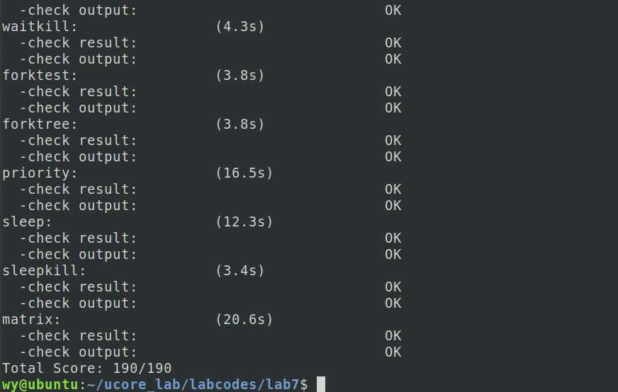

# ucore lab7 实验报告

## 实验目的

- 理解操作系统的同步互斥的设计实现；
- 理解底层支撑技术：禁用中断、定时器、等待队列；
- 在 ucore 中理解信号量（semaphore）机制的具体实现；
- 理解管程机制，在 ucore 内核中增加基于管程（monitor）的条件变量（condition variable）的支持；
- 了解经典进程同步问题，并能使用同步机制解决进程同步问题。
  
## 实验内容

实验六完成了用户进程的调度框架和具体的调度算法，可调度运行多个进程。如果多个进程需要协同操作或访问共享资源，则存在如何同步和有序竞争的问题。本次实验，主要是熟悉 ucore 的进程同步机制—信号量（semaphore）机制，以及基于信号量的哲学家就餐问题解决方案。然后掌握管程的概念和原理，并参考信号量机制，实现基于管程的条件变量机制和基于条件变量来解决哲学家就餐问题。

### 练习 0：填写已有实验

填写已有实验，并进行修改，具体修改为在处理时钟中断的时候，将sched_class_proc_tick函数修改为run_timer_list函数，用于支持定时器机制。

### 练习 1: 理解内核级信号量的实现和基于内核级信号量的哲学家就餐问题（不需要编码）

- 给出内核级信号量的设计描述，并说明其大致执行流程。

sem.h中定义了一个信号量数据结构以及用来支持内核级信号量机制的相关函数，信号量数据结构包括一个值和一个等待队列，sem_init是信号量初始化函数，__up对用原理中的V操作，__down对应原理中的P操作，try_down是不进入等待队列的P操作。分析sem.c中的实现代码：

sem_init: 对信号量进行初始化的函数，初始化信号量中的计数值和等待队列。

__up: 对应到了原理课中提及到的V操作，表示释放了一个该信号量对应的资源，如果有等待在了这个信号量上的进程，则将其唤醒执行；结合函数的具体实现可以看到其采用了禁用中断的方式来保证操作的原子性，函数中操作的具体流程为：查询等待队列是否为空，如果是空的话，给整型变量加1；如果等待队列非空，取出其中的一个进程唤醒。

__down: 同样对应到了原理课中提及的P操作，表示请求一个该信号量对应的资源，同样采用了禁用中断的方式来保证原子性，具体流程为：查询整型变量来了解是否存在多余的可分配的资源，是的话取出资源（整型变量减1），之后当前进程便可以正常进行；如果没有可用的资源，整型变量不是正数，当前进程的资源需求得不到满足，因此将其状态改为SLEEPING态，然后将其挂到对应信号量的等待队列中，调用schedule函数来让出CPU，在资源得到满足，重新被唤醒之后，将自身从等待队列上删除掉。


- 给用户态进程/线程提供信号量机制的设计方案，并比较说明给内核级提供信号量机制的异同。

将内核信号量机制迁移到用户态的最大麻烦在于，用于保证操作原子性的禁用中断机制、以及CPU提供的Test and Set指令机制都只能在用户态下运行，而使用软件方法的同步互斥又相当复杂，这就使得没法在用户态下直接实现信号量机制；于是，为了方便起见，可以将信号量机制的实现放在OS中来提供，然后使用系统调用的方法统一提供出若干个管理信号量的系统调用，分别如下所示：

    申请创建一个信号量的系统调用，可以指定初始值，返回一个信号量描述符；
    将指定信号量执行P操作；
    将指定信号量执行V操作；
    将指定信号量释放掉；

给内核级线程提供信号量机制和给用户态进程/线程提供信号量机制的异同点在于：

    相同点：
        提供信号量机制的代码实现逻辑是相同的；
    不同点：
        由于实现原子操作的中断禁用、Test and Set指令等均需要在内核态下运行，因此提供给用户态进程的信号量机制是通过系统调用来实现的，而内核级线程只需要直接调用相应的函数就可以了；

### 练习 2: 完成内核级条件变量和基于内核级条件变量的哲学家就餐问题（需要编码）

首先掌握管程机制，然后基于信号量实现完成条件变量实现，然后用管程机制实现哲学家就餐问题的解决方案（基于条件变量）。

- 内核级条件变量的设计描述，并说明其大致执行流程。

monitor.h中定义了条件变量和管程的数据结构，以及用来支持基于条件变量的管程机制的相关函数。条件变量利用信号量实现，count记录等在该条件变量上进程数量，owner记录了该条件变量所属的管程。cond_wait是将当前进程等在某个条件变量上，cond_signal是唤醒条件变量的等待队列中某个进程。分析sem.c中的实现代码：

```c
void cond_wait (condvar_t *cvp) {
    cprintf("cond_wait begin:  cvp %x, cvp->count %d, cvp->owner->next_count %d\n", cvp, cvp->count, cvp->owner->next_count);

    cvp->count ++; //等新等待队列长度
    if (cvp->owner->next_count > 0) { //next进程由先
        up(&cvp->owner->next);
    } else {
        up(&cvp->owner->mutex);
    }
    down(&cvp->sem); // 将自己等待在该条件变量上
    cvp->count --; // 自己被唤醒，修正等待队列上的进程计数

    cprintf("cond_wait end:  cvp %x, cvp->count %d, cvp->owner->next_count %d\n", cvp, cvp->count, cvp->owner->next_count);
}
```

```c
void cond_signal (condvar_t *cvp) {
   cprintf("cond_signal begin: cvp %x, cvp->count %d, cvp->owner->next_count %d\n", cvp, cvp->count, cvp->owner->next_count);  

    if (cvp->count > 0) { // 判断条件变量的等待队列是否为空
        cvp->owner->next_count ++;
        up(&cvp->sem); // 唤醒条件变量的等待队列中的某一个进程
        down(&cvp->owner->next);//当前进程阻塞在next信号量上
        cvp->owner->next_count --; // 当前进程被唤醒，恢复next上的等待进程数
    }

   cprintf("cond_signal end: cvp %x, cvp->count %d, cvp->owner->next_count %d\n", cvp, cvp->count, cvp->owner->next_count);
}
```

- 给用户态进程/线程提供条件变量机制的设计方案，并比较说明给内核级提供条件变量机制的异同。

在本实验中管程的实现中互斥访问的保证是完全基于信号量的，也就是如果按照上文中的说明使用syscall实现了用户态的信号量的实现机制，那么就完全可以按照相同的逻辑在用户态实现管程机制和条件变量机制；或者可以仿照用户态实现条件变量的方式，将对访问管程的操作封装成系统调用。

异同点为：

    相同点：基本的实现逻辑相同；
    不同点：最终在用户态下实现管程和条件变量机制，需要使用到操作系统使用系统调用提供一定的支持; 而在内核态下实现条件变量是不需要的；

- 能否不用基于信号量机制来完成条件变量？如果不能，请给出理由，如果能，请给出设计说明和具体实现。

能，可以直接利用信号量所使用的等待队列，再加上一个整形变量，可以实现条件变量。


### 执行make grade结果如下：



## 实验小结

- 参考答案分析对比

    与参考答案相同

- 实验中重要知识点与其对应的OS原理
    
    信号量；
    管程和条件变量；
    哲学家就餐问题；
    
- 本次实验中未涉及的知识点有

    使用原子指令实现同步互斥；
    生产者-消费者问题；
