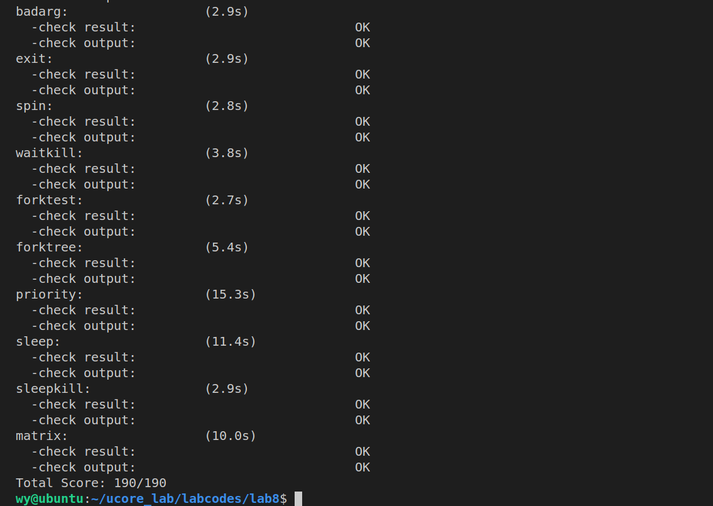
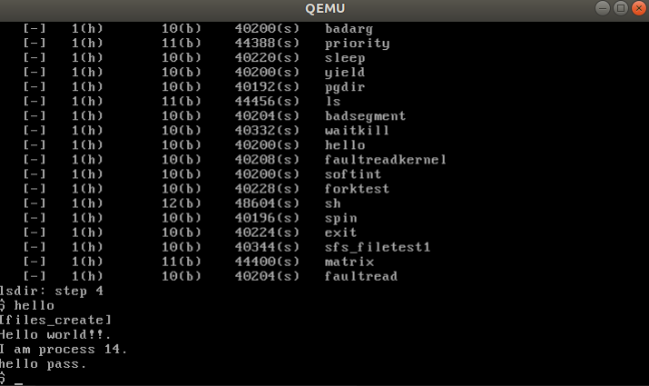

# ucore lab8 实验报告

## 实验目的
- 了解基本的文件系统系统调用的实现方法；
- 了解一个基于索引节点组织方式的 Simple FS 文件系统的设计与实现；
- 了解文件系统抽象层-VFS 的设计与实现；
    
## 实验内容

本次实验涉及的是文件系统，通过分析了解 ucore 文件系统的总体架构设计，完善读写文件操作，从新实现基于文件系统的执行程序机制（即改写 do_execve），从而可以完成执行存储在磁盘上的文件和实现文件读写等功能。

### 练习 1: 完成读文件操作的实现

首先了解打开文件的处理流程，然后参考本实验后续的文件读写操作的过程分析，编写在 sfs_inode.c 中 sfs_io_nolock 读文件中数据的实现代码。

读文件的函数调用流程：read-->sys_read->syscall-(通过系统调用进入内核)->sys_read-->sysfile_read--->file_read-->vop_read(sfs_read)-->sfs_io_nolock

可分为三部分进行处理，第一部分读取头部没有对齐的部分，第二部分读取若干完整的 block，第三部分读取结尾没有对齐的部分。每部分中都调用 sfs_bmap_load_nolock 函数得到 blkno 对应的 inode 编号，并调用 sfs_rbuf 或 sfs_rblock 函数读取数据（sfs_rbuf 内部实际上也是先读取一个 block 再取出相应的部分），并在每次成功读取一定长度的内容后都要更新实际读取长度，和buffer。

- 设计实现”UNIX 的 PIPE 机制“的概要设计方案，鼓励给出详细设计方案

当两个进程之间要求建立管道，可以在内存中映射一个pipe文件，并加入到两个进程的文件列表中。当进程通过标准输入或输出进行读或写时，由系统调用进入内核，可以增加对于管道机制的判断，若存在管道，则通过read 从该pipe文件读取数据，通过write将数据写入该pipe文件。其中可能要增加信号量用于实现同步互斥。


### 练习 2: 完成基于文件系统的执行程序机制的实现

改写 proc.c 中的 load_icode 函数和其他相关函数，实现基于文件系统的执行程序机制。

在进程控制块的初始化中增加对于filesp的初始化;在fork中调用copy_files复制父进程的files_struct。

load_icode中相较于lab7，读取的ELF文件不再是来自内存，而是需要利用文件系统的read操作从磁盘读取，另外加入了argc argv参数，需要将参数压入用户栈中。实现步骤流程参照注释和lab7。

从硬盘读取ELF文件，是通过调用load_icode_read函数完成。
```c
// (3) copy TEXT/DATA/BSS parts in binary to memory space of process
    struct Page *page;
    // (3.1) read raw data content in file and resolve elfhdr
    struct elfhdr _elf, *elf = &_elf;
    if ((ret = load_icode_read(fd, elf, sizeof(struct elfhdr), 0)) != 0) {
        goto bad_elf_cleanup_pgdir;
    }
    if (elf->e_magic != ELF_MAGIC) { //合法性检查
        ret = -E_INVAL_ELF;
        goto bad_elf_cleanup_pgdir;
    }
    
    struct proghdr _ph, *ph = &_ph;
    uint32_t vm_flags, perm;
    for (int i = 0; i < elf->e_phnum; ++ i) {
        // (3.2) read raw data content in file and resolve proghdr based on info in elfhdr
        load_icode_read(fd, (void *) ph, sizeof(struct proghdr), elf->e_phoff + i * sizeof(struct proghdr)); // 读取program header
        if (ph->p_type != ELF_PT_LOAD) {
            continue;
        }
        if (ph->p_filesz > ph->p_memsz) { 
            ret = -E_INVAL_ELF;
            goto bad_cleanup_mmap;
        }
        if (ph->p_filesz == 0) {
            continue;
        }
        // (3.3) call mm_map to build vma related to TEXT/DATA
        vm_flags = 0, perm = PTE_U;
        if (ph->p_flags & ELF_PF_X) vm_flags |= VM_EXEC;
        if (ph->p_flags & ELF_PF_W) vm_flags |= VM_WRITE;
        if (ph->p_flags & ELF_PF_R) vm_flags |= VM_READ;
        if (vm_flags & VM_WRITE) perm |= PTE_W;
        if ((ret = mm_map(mm, ph->p_va, ph->p_memsz, vm_flags, NULL)) != 0) {
            goto bad_cleanup_mmap;
        }
        
        off_t offset = ph->p_offset;
        size_t off, size;
        uintptr_t start = ph->p_va, end, la = ROUNDDOWN(start, PGSIZE);
        ret = -E_NO_MEM;
        // (3.4) call pgdir_alloc_page to allocate page for TEXT/DATA, read contents in file and copy them into the new allocated pages
        end = ph->p_va + ph->p_filesz;
        while (start < end) {
            if ((page = pgdir_alloc_page(mm->pgdir, la, perm)) == NULL) {// 为TEXT/DATA段逐页分配物理内存空间
                goto bad_cleanup_mmap;
            }
            off = start - la, size = PGSIZE - off, la += PGSIZE;
            if (end < la) {
                size -= la - end;
            }
            if ((ret = load_icode_read(fd, page2kva(page) + off, size, offset)) != 0) {// 将磁盘上的TEXT/DATA段读入到分配好的内存空间中去
                goto bad_cleanup_mmap;
            }
            start += size, offset += size;
        }
        // (3.5) call pgdir_alloc_page to allocate pages for BSS, memset zero in these pages
        end = ph->p_va + ph->p_memsz;
        if (start < la) { // 如果存在BSS段，并且先前的TEXT/DATA段分配的最后一页没有被完全占用，则剩余的部分被BSS段占用，因此进行清零初始化
            if (start == end) {
                continue;
            }
            off = start + PGSIZE - la, size = PGSIZE - off;
            if (end < la) {
                size -= la - end;
            }
            memset(page2kva(page) + off, 0, size); // init all BSS data with 0
            start += size;
            assert((end < la && start == end) || (end >= la && start == la));
        }
        while (start < end) {  // 如果BSS段还需要更多的内存空间的话，进一步进行分配
            if ((page = pgdir_alloc_page(mm->pgdir, la, perm)) == NULL) { // 为BSS段分配新的物理内存页
                goto bad_cleanup_mmap;
            }
            off = start - la, size = PGSIZE - off, la += PGSIZE;
            if (end < la) {
                size -= la - end;
            }
            memset(page2kva(page), 0, size); // 将分配到的空间清零初始化
            start += size;
        }

    }
```
命令行参数机制，需要计算参数所占用内存大小，定位argv数组以及栈顶argc位置，并将argv参数复制到栈中相应位置。

```c
// (6) setup uargc and uargv in user stacks
    uint32_t argv_size = 0;
    for (int i = 0; i < argc; i ++) {
        argv_size += strnlen(kargv[i],EXEC_MAX_ARG_LEN + 1)+1; // includinng the ending '\0'
    }
    argv_size = (argv_size / sizeof(long) + 1) * sizeof(long); //alignment
    uintptr_t stacktop = USTACKTOP - argv_size;

    char** uargv=(char **)(stacktop  - argc * sizeof(char *));// argv array
    argv_size = 0;
    for (int i = 0; i < argc; i ++) {
        uargv[i] = strcpy((char *)(stacktop + argv_size ), kargv[i]);// 将argv[j]指向的数据拷贝到用户栈中
        argv_size +=  strnlen(kargv[i],EXEC_MAX_ARG_LEN + 1)+1;
    }
    stacktop = (uintptr_t)uargv - sizeof(int); //for argc
    *(int *)stacktop = argc; 
```

- 设计实现基于”UNIX 的硬链接和软链接机制“的概要设计方案，鼓励给出详细设计方案

硬链接：增加相应的系统调用，首先找到被链接文件的inode,在目标目录中添加一项，记录该inode的block，并将该inode的nlinks值加一

软链接：增加相应的系统调用，创建软链接需要创建一个正常文件的inode，可以用type域来标记软链接类型，然后需要记录被链接的文件inode，打开文件时，需要再根据记录的inode地址再次查询，找到被链接的文件inode，不涉及被链接文件inode的nlinks，删除链接时直接直接将该软链接的inode直接删除即可。


## 实验结果如下：




## 实验小结

- 参考答案分析对比
  
  练习一：实现思路一致，但对于整块数据的读取，答案采取一块一块读的方式，也可以若干块一起读取。一块一块的读可以更好的监控失败的情况，一起读可能效率高一些。
  
  练习二：基本一致

- 实验中重要知识点与其对应的OS原理
  
    虚拟文件系统；
    SFS文件系统；
    将设备抽象为文件的管理方式；
    文件描述符；
    目录、文件；
    文件别名；
    ELF文件格式；
   
- 本次实验中未涉及的知识点有

    文件分配；
    空闲空间管理和冗余磁盘阵列；


